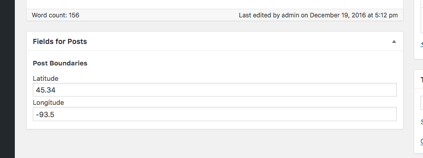

# GeoMeta for ACF Field


GeoMeta for ACF is an easy way to store location information about posts, pages,
users or other content types that ACF supports. The default input is a map
with drawing tools to let the user draw markers, lines and polygons.
Alternatively you can accept latitude and longitude values, or raw GeoJSON
text.

GeoMeta for ACF supports for both ACF version 4  and 5.

Why use GeoMeta for ACF instead of one of the other map inputs for ACF? 

GeoMeta for ACF uses WP-GeoMeta under the hood, which means that you're
actually storing spatial meta data, not just text. With the WP-GeoMeta library
you have access to all of the spatial functions MySQL supports to search and
filter your WordPress posts and users. 

### Compatibility

This ACF field type is compatible with:
* ACF 5
* ACF 4

### Installation

Be sure that Advanced Custom Fields is installed. You can use Advanced Custom
Fields (v4) or Advanced Custom Fields PRO (v5). Version 4 is [in the
plugin repository](https://wordpress.org/plugins/advanced-custom-fields/). ACF
PRO is [available from
https://www.advancedcustomfields.com/pro/](https://www.advancedcustomfields.com/pro/).

With ACF installed, you can install this plugin in the usual WordPress way.

1. Upload the plugin files to the `/wp-content/plugins/geometa-acf` directory,
	or install the plugin through the WordPress plugin screen directly.
2. Activate the plugin through the 'Plugins' screen in WordPress.

Create a new field in ACF and select the GeoMeta field type.

### Usage

At its most basic, you can use this like you would any other ACF field. Add it to a post type, edit a post and add values to the GeoMeta for ACF field, etc.

To unlock this plugin's full potential you can query and filter your data using MySQL's spatial functions. This plugin uses WP-GeoMeta, which means that you can make these spatial right within WP_Query, wp_get_posts, and anything els that use [WP_Meta_Query internally](https://codex.wordpress.org/Class_Reference/WP_Meta_Query). 

For sample queries and more information, please see the [WP-GeoMeta
documentation](https://github.com/cimburadotcom/wp-geometa);

### Screenshots

You can configure Geometa for ACF like you do any other Advanced Custom Field.


The default input method is a map with the Leaflet.Draw tools. You're not limited to points
with Geometa for ACF. You can store points, lines, polygons or a mix of the three.

There is also a geolocation button to position the map at your current location.


Coordinates are also supported. If you, or your users, will have known coordinates you can offer
a simple pair of latitude/longitude inputs.


You can also enable raw-GeoJSON input for power users or for debugging. 


### Bring Your Own Geocoder (Alpha feature)

To enable BYOG, please define GEOMETA_ACF_BYOGC to true.

```
define('GEOMETA_ACF_BYOGC',true);
```

GeoMeta for ACF includes an advanced field, *Bring Your Own Geocoder* (BYOG). 

This is provided because good geocoders require an API key which *you* will need to obtain, and the fields you 
collect may be different that the fields someone else collects.

BYOG doesn't give the user a way to enter spatial data. Instead it provides a button that trigger a JavaScript 
action when clicked action that you can do your own GeoCoding. It also provides a callback to store the in a 
hidden GeoJSON field. 

#### Use Case

You might have a set of text fields *Street*, *City*, *State*, *ZIP*. 

When the editor clicks the Geocode button, the JavaScript event `geometa-acf/byo-geocode` will fire. 

The handler will receive 3 arguments: 
 1. The triggered event
 2. The original click event
 3. The callback handler

You will find the fields you want to get data from, and construct a Geocoding request. With the results
you construct a GeoJSON Feature and then submit it to the callback. 


In pseudo code it would look like this:
```
jQuery(document).on('geometa-acf/byo-geocode',function(e, origEvent, callback){
		// Do your geocoding
		var results = do_my_geocoding();

		// If your geocoding results aren't in GeoJSON format, then create a GeoJSON object
		var geojson = my_results_to_geojson( results );

		// Submit a GeoJSON object to the callback
		callback( geojson );
}
```


A more real life example might look something like this, using Geocod.io as the Geocoder:

```
jQuery(document).on('geometa-acf/byo-geocode',function(e, origEvent, callback){

	// Make an AJAX call to Geocod.io and get a promise back.
 	var geopromise = jQuery.getJSON('https://api.geocod.io/v1/geocode', {
		'street' : jQuery('input[name$="[field_57d19a6b27644]"]').val(),
		'city' : jQuery('input[name$="[field_57d199a227642]"]').val(),
		'state' : jQuery('input[name$="[field_57d199ac27643]"]').val(),
		'postal_code' :  jQuery('input[name$="[field_57d19a7727645]"]').val(),
 		'api_key': myfile.geocodio_api_key // Use wp_localize_script to not hard code your API key into your JavaScript!
 	}, );

	// When the promise has been fulfilled, handle success or failure
	geopromise.then(
		function( success ){

			var geojson;

			// On success, if we got results...
			if ( success.results.length > 0 ) {
				var res = success.results[0];

				// And the accurace is better than state level (1 = rooftop, 5 = city level, 6 = statelevel)
				if ( res.accuracy <= 5 )  {

					// Make a GeoJSON object
					var geojson = {
						'type': 'Feature',
						'geometry': {
							'type' : 'Point',
							'coordinates' : [ res.location.lng, res.location.lat ]
						},
						'properties' : res.address_components
					};
				}
			}

			// And pass the object into the callback
			callback( geojson );
		}, function( failure ) {

			// Otherwise pass in anything else (or nothing) to clear the current value,
			// or don't call the callback at all to leave the existing result in place
			callback();
		}
	);
});
```
